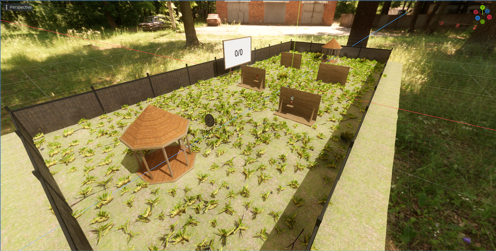

# Simple multiplayer VR throwing game

## About

This project came into existence as a result of YouTube project [link](TBD) and is a simple multiplayer VR throwing game. The game is built using Godot. The objective is to throw an item at an opponent's head. **DO NOT TAKE THIS PROJECT AS A PERFECT EXAMPLE OF HOW TO MAKE A MULTIPLAYER GAME.** This is just a quick and dirty project made for entertainment purposes.

## Assets

You are free to use any assets from this project in your own projects. The only exception are the addons which have their own licenses.
All 3D models and sound effects are made by me and are licensed under MIT license. Textures are from [PolyHaven](https://polyhaven.com/) and licensed under CC0 license.
